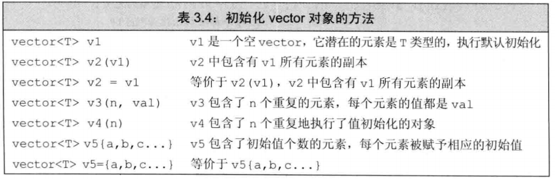

## 标准库类型vector用法

#### 头文件+声明

```c++
#include<vector>
using std::vector;
```

#### 初始化



#### 方法

```c++
vector<int> v;
v.push_back(); //添加
v.insert(v.begin(), 1); // 在首部插入1
```

```c++
vector<int> ivec;
for (decltype(ivec.size()) ix = 0; ix != 10; ++ix)  //decltype 自动识别ivec.size()类型
	ivec.push_back(ix);
```

#### 使用迭代器遍历vector

```c++
vector<int>::iterator it; //it能读写

vector<int>::const_iterator it2; //只能读
```

#### 交换两个元素位置

```c++
vector<int> sentence = {1,2,3,4,5};
swap(sentence[0] ,sentence[4]);
```

#### 删除指定元素

```c++
vector<int> sentence = {1,2,3,4,5};
sentence.erase(sentence.begin()+1);
```

#### 删除最后一个元素

```c++
sentence.pop_back();
```

#### vector最后一个元素

```
sentence[sentence.size()-1];
sentence.back();
*sentence.end();
```


#### assign用法

```c++
// assign函数原型：
void assign(const_iterator first, const_iterator last);
void assign(size_type, const T&x=T());

//功能：将区间[first, last)的元素赋值道当前vector容器中，或者赋值n个值为x的元素到vector容器中，这个容器会清楚掉vector中以前的内容
```

#### 判读某个元素是否存在

```c++
vector<int> list;
int nRet = std::count(list.begin(), list.end(), 1);
```

